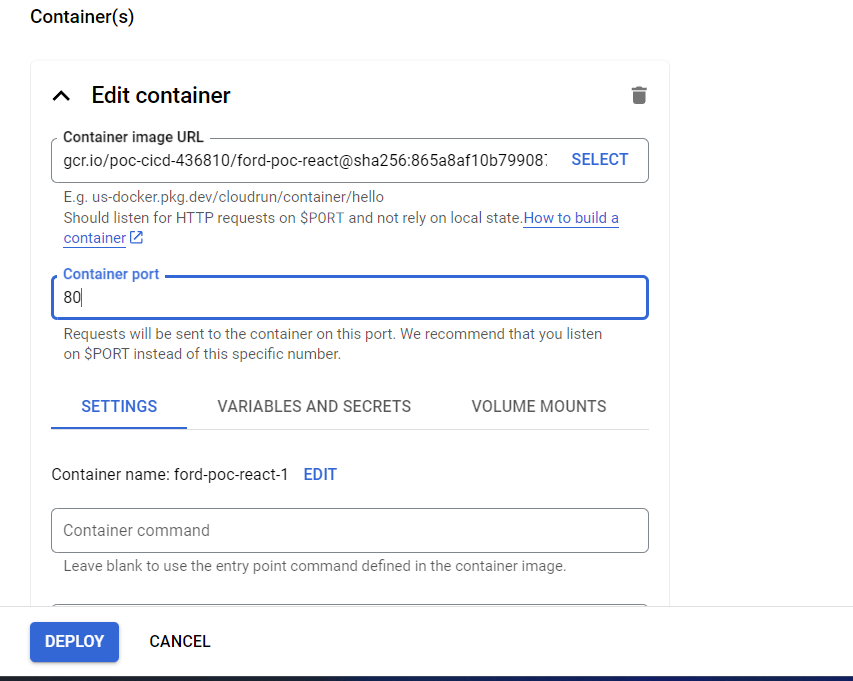

# Steps to build the docker image
1. Build your project for a specific environment e.g. npm run build or stagebuild etc
2. Then run => npm run dockerize [This will dockerize the dist folder along with server]
3. In the terminal run --> docker images  [to see you image that was built]
4. To run the image in the docker 
    docker run -p 8080:80 ford-poc-react-stg   // use -stg for staging and -prd for prod
    You should see your your application running at localhost:8080
5. To stop the image from running
    a. First identify the containers that are running
        docker ps
    b. Identify the container id and then
        docker stop ca29679fca28

# Creating builds/images based on the env [TODO]

# Steps to push the image in the GCR {Google cloud registry} TODO
Go to gcr.io and enable the Google Artifact registry.
1. Tag the image that will be pushed.
    docker tag your-image-name gcr.io/gcp-project-id/your-image-name
    E.g. docker tag ford-poc-react-stg gcr.io/poc-cicd-436810/ford-poc-react-stg
2. Authenticate the docker
    gcloud auth configure-docker

    Prerequisites
    --------------
    To run the above step you first need to have sdk installed from =>https://dl.google.com/dl/cloudsdk/channels/rapid/GoogleCloudSDKInstaller.exe
    Then, open the cmd and do gcloud --version if you see the version that means it installation was correct. Then do --> gcloud auth login
    Then set your project id --> gcloud config set project cicd-435406
    Then execute --> gcloud auth configure-docker and enter Y

3. Push the image to the GCR
    docker push gcr.io/gcp-project-id/your-image-name

    E.g. docker push gcr.io/poc-cicd-436810/ford-poc-react-stg

4. Deploy to the cloudrun
    gcloud run deploy your-service-name \
  --image gcr.io/gcp-project-id/your-image-name \
  --platform managed \
  --region your-region \
  --allow-unauthenticated
  --set-env-vars PORT=80

  E.g.
  gcloud run deploy cr-ford-poc --image gcr.io/cicd-435406/ford-poc-react --platform managed --region us-central1 --allow-unauthenticated --set-env-vars PORT=80

  Once you hit the above command you will get =>
  The following APIs are not enabled on project [cicd-435406]:
        run.googleapis.com

  Do you want enable these APIs to continue (this will take a few minutes)? (Y/n)?  Type Y
  TODO : Reached here but got an error =>ERROR: (gcloud.run.deploy) Revision 'cr-ford-poc-00001-vx4' is not ready and cannot serve traffic. The user-provided container failed to start and listen on the port defined provided by the PORT=8080 environment variable. Logs for this revision might contain more information.
  
  Once deployed, you will receive a URL to access your static application running on Cloud Run.
  [solution => the problem was that cloud run expects the exposed port to be 8080 but we exposed 80, hence reconfigure the cloudrun visually by selecting a right port]
  Look ate the below image

